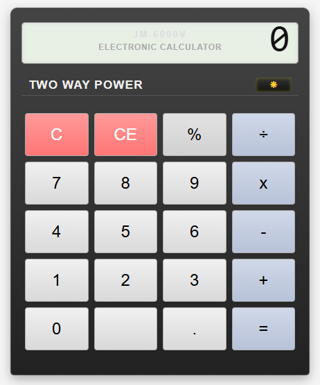

# GitHub Copilot Workshop

## Enhance a .NET Calculator app using GitHub Copilot



In this fun workshop, you will learn how to use GitHub Copilot to enhance a .NET-based Calculator, with little to no coding experience required.

The project contains a simple ASP.NET Core application that provides a web-based calculator interface to perform arithmetic operations, and includes a complete MVC structure with controllers, models, and views.

Estimated time to complete: `10 to 60 minutes`

Participants will be guided to install the GitHub Copilot VS Code extension, and then use it to enhance a simple .NET Calculator app. You will also use GitHub Copilot to write some missing unit tests for the Calculator app.

## Instructions 

Inside the `instructions` folder you will find a number of markdown files that contain the instructions for this workshop.

Filename | Description
--- | ---
[1. setup.md](</instructions/1. setup.md>) | Instructions for installing the GitHub Copilot VS Code extension and joining the GitHub Copilot trial.
[2. core exercises.md](</instructions/2. core exercises.md>) | Instructions for the core exercise of this workshop.
[3. challenge exercises.md](</instructions/3. challenge exercises.md>) | Challenge exercises for participants to complete.

## Running a workshop?

If you're planning to run a GitHub Copilot workshop, please review the [workshop guide](</.instructions/workshop organisers.md>) for tips and tricks to help you run a successful workshop.

## Project Structure

In this project you will find: 

* the .NET-based Calculator application built with ASP.NET Core MVC
* a `MyCalculator.Test` folder containing unit tests for the Calculator app
* a `.github` folder with Copilot and workflow instructions
* an `instructions` folder with all the instructions for this workshop
* an `assets` folder containing images used in this workshop documentation

### Application Components

- **Controllers**: Contains `CalculatorController.cs` which handles HTTP requests related to calculator operations.
- **Models**: Contains `CalculatorModel.cs` which defines the data structure for the calculator, including properties for operands and the result.
- **Views**: Contains Razor views for the calculator interface.
  - `Index.cshtml`: The main view for the calculator application.
  - `_ViewImports.cshtml`: Imports common namespaces and directives for the views.
- **wwwroot**: Contains static files such as CSS and JavaScript.
  - `css/site.css`: Styles for the calculator interface.
  - `js/calculator.js`: JavaScript code for handling user interactions.
- **Configuration Files**:
  - `appsettings.json`: Configuration settings for the application.
  - `Program.cs`: Entry point of the application.
  - `Startup.cs`: Configures services and the request pipeline.

## Getting Started

To set up and run the application, follow these steps:

1. **Clone the repository**:
   ```
   git clone <repository-url>
   cd CopilotNetCalculator
   ```

2. **Restore dependencies**:
   ```
   dotnet restore
   ```

3. **Run the application**:
   ```
   dotnet run
   ```

4. **Access the application**:
   Open your web browser and navigate to `http://localhost:5000` to use the calculator.

## Features

- Perform basic arithmetic operations: Addition, Subtraction, Multiplication, and Division.
- User-friendly interface with responsive design.
- Input validation to ensure correct calculations.

## FAQ 

- **How do I get a GitHub Copilot license?**
  - You can request a trial license from your GitHub Sales representative or via Copilot for Individuals or Business licenses.
- **How do I get a GitHub Codespaces license?**
    - Codespaces is included with GitHub Enterprise Cloud, GitHub Enterprise Server, and GitHub Free. You can check under your [billing settings page](https://github.com/settings/billing).
- **I am having trouble activating GitHub Copilot after I load the plugin, what should I do?**
    - This could be because you launched your Codespace before you activated GitHub Copilot or accepted the invitation to the trial org. Please try to reload your Codespace and try again.

## Contributing

Contributions are welcome! Please feel free to submit a pull request or open an issue for any suggestions or improvements.

## License

This project is licensed under the MIT License. See the LICENSE file for more details.