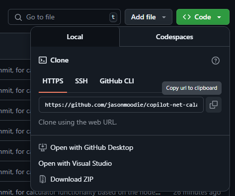

# Environment setup

To set up and run the application, follow these steps:

**Clone the repository**:
   git clone 
  1. Navigate to the [Copilot-node-calculator](https://github.com/jasonmoodie/copilot-net-calculator) repo
  2. Clone this repo to your local machine using your preferred method.
     
     

### What's next?
You're now ready to start the [core exercises](<./2. core exercises.md>)